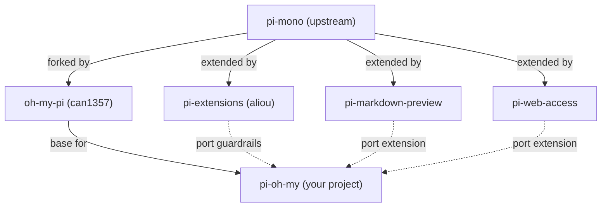

# Pi-Oh-My: Technical Implementation Outline

## Landscape Summary

The workspace contains five reference repos with this relationship:



---

## Decision 1: No Fork Needed -- Use omp As-Is with Extensions + External Orchestrator

**Do NOT fork oh-my-pi. Use it as an installed dependency and build everything on top.**

oh-my-pi's extension API and CLI flags are rich enough to cover every customization need:

**CLI flags available per-session:**

- `--system-prompt <path>` -- inject persona-specific prompts
- `--append-system-prompt <text>` -- layer additional instructions
- `--extension <path>` / `-e <path>` -- load per-session extensions
- `--session-dir <path>` -- control where session JSONL lives
- `--resume` / `--continue` -- resume existing sessions
- `--models` -- set per-persona model preferences

**Extension API capabilities:**

- `registerTool()` -- add custom tools (artifact management, signaling)
- `registerCommand()` -- add `/approve`, `/reject`, `/status` commands
- `setActiveTools()` -- restrict tools per persona
- `before_agent_start` hook -- replace system prompt, inject messages
- `tool_call` event -- intercept and enforce write constraints (e.g., PM can only write SPEC.md)
- `session_start` / `session_shutdown` -- lifecycle hooks for signaling the orchestrator

**What lives where:**

- `omp` binary: installed globally, never modified
- `pi-oh-my/extensions/`: loaded into each omp session via `-e` flag
- `pi-oh-my/orchestrator/`: separate process that manages Zellij sessions and workflow state
- `.pi-oh-my/trees/`: git-tracked artifacts in the target repo

---

## Decision 2: Disable Plan Mode via Extension

oh-my-pi's plan mode consists of:

- `src/plan-mode/state.ts` -- state management
- `src/plan-mode/plan-mode-guard.ts` -- file locking enforcement
- `src/plan-mode/exit-plan-mode-tool.ts` -- the exit tool
- Registration in `src/slash-commands/builtin-registry.ts`

A small extension can neutralize it:

1. Intercept `session_start` to ensure plan mode state is never enabled.
2. Deregister the `/plan` command or make it a no-op.
3. Remove the `exit_plan_mode` tool from active tools via `before_agent_start`.

No core code changes needed.

---

## Decision 3: Zellij over tmux

Neither pi-mono nor oh-my-pi has built-in support for either multiplexer. oh-my-pi only detects `TMUX_PANE` in `packages/tui/src/ttyid.ts` for terminal identification, and has zero Zellij awareness. There is no built-in advantage to tmux.

Zellij is preferred because:

- Better session naming (`zellij attach --create session-name`) maps cleanly to the tree model where each session is a named Zellij session.
- Built-in layout files (KDL) and pane management via CLI (`zellij action`).
- `zellij run` can launch processes in named panes, and `zellij action write` can send keystrokes -- useful for operator interaction.

**Integration approach:**

- Zellij TTY detection: oh-my-pi's `ttyid.ts` falls through to other detection methods when `ZELLIJ_SESSION_NAME` isn't checked. A 2-line upstream PR could add it, but no fork is needed.
- Build a Zellij manager module in `pi-oh-my` that creates/attaches/destroys sessions programmatically via `zellij` CLI calls.
- Each agent session = one Zellij session named `<tree-name>/<persona>-<id>`.
- The dev environment = a persistent Zellij session `<tree-name>/dev`.

---

## Decision 4: Port Extensions from pi to omp

**Problem:** `pi-extensions` targets `@mariozechner/pi-coding-agent` (upstream pi), not `@oh-my-pi/pi-coding-agent`. The extension API signatures are similar but the package names differ.

**Solution:** Port the specific extensions needed rather than trying to make pi-extensions work wholesale.

- **pi-guardrails**: Port as an oh-my-pi extension (the API surface is nearly identical).
- **pi-markdown-preview**: Already a standalone extension, port to `@oh-my-pi` imports.
- **pi-web-access**: Already standalone, port similarly.
- **Subagents from pi-extensions**: Skip -- oh-my-pi's Task tool with `runSubprocess` is more capable.

---

## Project Structure

**No fork.** `omp` is a runtime dependency, not a codebase to modify.

```
pi-oh-my/
  package.json                    # Depends on @oh-my-pi/pi-coding-agent (types only)
  tsconfig.json

  src/
    cli.ts                        # Entry point: `pom init|tree|attach|status`

    orchestrator/
      tree.ts                     # Tree lifecycle: create, load, persist state
      tracker.ts                  # TRACKER.md generation and updates
      workflow.ts                 # Workstream state machine (PM->Arch->Solver->Eng/QA->Meta)
      session-spawner.ts          # Spawn omp processes in Zellij panes via CLI flags

    personas/
      types.ts                    # Persona type definitions
      pm.ts                       # PM system prompt, tool restrictions, SPEC.md template
      architect.ts                # Architect prompt, BLUEPRINT.md template
      solver.ts                   # Solver prompt, CHUNK.md template
      engineer.ts                 # Engineer prompt, full tool access
      qa.ts                       # QA prompt, review-focused tools
      meta.ts                     # Meta prompt, retrospective analysis

    zellij/
      manager.ts                  # Create/attach/destroy Zellij sessions
      layout.ts                   # KDL layout templates for tree UX

    extensions/                   # Loaded into omp at runtime via `omp -e <path>`
      disable-plan-mode.ts        # Neutralize oh-my-pi's built-in plan mode
      git-artifacts.ts            # Enforce git-tracked .md artifacts
      github-review.ts            # GH CLI for PR comments (Eng/QA)
      guardrails.ts               # Ported from pi-extensions
      markdown-preview.ts         # Ported from pi-markdown-preview
      web-access.ts               # Ported from pi-web-access

    artifacts/
      spec.ts                     # SPEC.md read/write/validate
      blueprint.ts                # BLUEPRINT.md read/write/validate
      chunk.ts                    # CHUNK.md read/write/validate with task checkboxes
      tracker.ts                  # TRACKER.md status tracking

    skills/
      github-pr.ts                # Skill: create/manage PRs via gh CLI
      github-review.ts            # Skill: post/read/resolve review comments
```

Metadata for an active workstream lives in the target repo:

```
<target-repo>/
  .pi-oh-my/
    trees/
      feat-foo/
        SPEC.md
        BLUEPRINT.md
        TRACKER.md
        chunk-1/
          CHUNK.md
        chunk-2/
          CHUNK.md
        ...
```

---

## Key Architecture

### How Sessions Are Spawned

Each persona session is a separate `omp` process launched by the orchestrator into a Zellij pane. No SDK import or in-process subagent needed -- just CLI invocation:

```bash
omp \
  --system-prompt ./personas/pm.md \
  --session-dir .pi-oh-my/trees/feat-foo/pm \
  -e ./extensions/disable-plan-mode.ts \
  -e ./extensions/git-artifacts.ts
```

The orchestrator wraps this in a Zellij session so the operator can attach/detach freely.

### Operator Interaction Model

The orchestrator (`pom` CLI) is the outer loop:

1. It creates the Zellij sessions and launches `omp` processes.
2. The operator attaches to whichever session needs attention.
3. When the operator signs off on an artifact (e.g., SPEC.md), they signal the orchestrator (e.g., `/approve` command or a file-based signal).
4. The orchestrator advances the workflow state machine and spawns the next session.

### Communication Between Orchestrator and Sessions

- **File-based signals**: Artifacts (SPEC.md, BLUEPRINT.md, etc.) in `.pi-oh-my/trees/` are the primary communication channel, just like the swarm extension uses filesystem signals.
- **Orchestrator watches for changes**: The orchestrator watches the tree directory for artifact completion signals.
- **omp extensions**: Custom extensions loaded into each `omp` session enforce persona-specific constraints (e.g., PM can only write SPEC.md, Engineer has full file access).

---

## Implementation Phases

### Phase 1: Foundation

- Set up the pi-oh-my project (TypeScript, no fork).
- Build the Zellij manager (create/attach/list/destroy sessions).
- Build the `disable-plan-mode` extension.
- Create persona prompt templates (PM, Architect, Solver, Engineer, QA, Meta).

### Phase 2: Orchestration Core

- Build the tree lifecycle (init, persist, load).
- Build the workflow state machine (PM -> Architect -> Solver -> Eng/QA -> Meta).
- Build the session spawner (launch `omp` in Zellij panes with persona config).
- Build artifact templates (SPEC.md, BLUEPRINT.md, CHUNK.md, TRACKER.md).

### Phase 3: Execution Loop

- Build the Engineer/QA cycle with GitHub PR integration.
- Build the chunk branch management (create branch, squash-merge).
- Build the TRACKER.md auto-update on chunk completion.

### Phase 4: UX and Polish

- Build the tree sidebar view (could be a Zellij layout or a separate TUI).
- Port extensions (guardrails, markdown-preview, web-access).
- Build the Meta agent retrospective flow.
