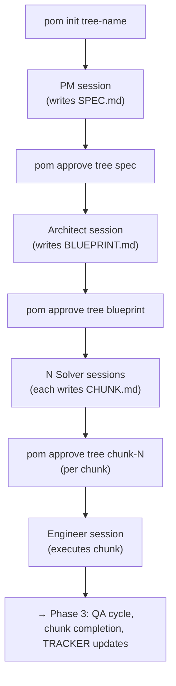

# Phase 2: Orchestration Core

## Implementation Status

| Task | Description | Status |
|------|-------------|--------|
| Task 0 | Orchestrator type definitions | ✅ Complete |
| Task 1 | Tree lifecycle (init, load, persist) | ✅ Complete |
| Task 2 | Artifact modules (spec, blueprint, chunk, tracker) | ✅ Complete |
| Task 3 | Session spawner with context builders | ✅ Complete |
| Task 4 | Workflow state machine with `approve()` | ✅ Complete |
| Task 5 | Wire up pom CLI | ✅ Complete |
| Task 6 | Bug fixes: session key format + write tool names | 🔴 Pending |
| Task 7 | Artifact guard extension (constrained writes) | 🔴 Pending |
| Task 8 | CHECKPOINT.md support | 🔴 Pending |

### Known Bugs (to be fixed in Tasks 6–8)

**Bug A — Missing write tools**: `RESEARCH_TOOLS` and `RESEARCH_WITH_WEB_TOOLS` in `configs.ts`
only list read-side tools (`read`, `bash`, `grep`, `find`). PM, Architect, and Solver cannot
write their artifacts without `write`/`edit` in `allowedTools`. The `bash` tool is a workaround
but bypasses any future artifact enforcement. Write tools must be added explicitly.

**Bug B — Session key includes redundant `chunk-` prefix**: `spawnSession` builds
`sessionKey = "${role}-${chunkId}"` where `chunkId` is already `"chunk-1"`. This produces
`solver-chunk-1` / `feat-foo__solver-chunk-1` instead of the intended `solver-1` /
`feat-foo__solver-1`. `getActiveSession` in `workflow.ts` has a matching bug:
`tree.sessions[\`engineer-${tree.activeChunkId}\`]` would look up `engineer-chunk-1`. These
are consistent so nothing breaks, but the session names are ugly and inconsistent with the
documented key format.

---

## Context

Phase 1 produced the foundation:

- `src/personas/` — all persona types, configs, and system prompts
- `src/zellij/` — full Zellij session manager (create, list, attach, kill, spawnPane)
- `extensions/disable-plan-mode.ts` — plan mode neutralizer
- `src/cli.ts` — stub CLI (all commands print "not yet implemented")
- `src/orchestrator/` — empty placeholder directory

Phase 2 builds out the orchestration core so `pom init <tree-name>` actually works
end-to-end: it creates a tree in the target repo, spawns a PM `omp` session in Zellij,
and the operator can chat with it. Then `pom approve` advances the workflow through
architect → solvers → engineers.

### Workflow at a Glance




### Key Invariants

- Tree metadata lives at `<targetRepo>/.pi-oh-my/trees/<tree-name>/state.json`
- Each persona session gets its own Zellij session: `<tree-name>__<role>[-<chunkId>]`
  (Zellij-safe delimiter; e.g. `feat-foo__pm`, `feat-foo__solver-1`, `feat-foo__engineer-1`)
- Each `omp` session's JSONL files live at `<treeDir>/<role>[-<chunkId>]/`
- The pi-oh-my package root is resolved at runtime via `import.meta.url`
- PM/Architect/Solver can write their artifacts via `bash` (already in their allowlist). The
`git-artifacts` extension (Phase 3) will enforce per-file restrictions via `tool_call` hooks.
- Tool names in `PERSONA_CONFIGS` must match the exact names `omp` registers at runtime. Task 0
includes a step to look these up from the `oh-my-pi` source before proceeding.

---

## New File Structure After Phase 2

```
pi-oh-my/
  src/
    cli.ts                      ← updated: init, approve, attach, status wired up
    orchestrator/               ← was empty, now populated
      types.ts                  ← new: WorkflowStage, ChunkState, TreeState, SessionRef
      tree.ts                   ← new: initTree, loadTree, persistTree, getTreeDir
      session-spawner.ts        ← new: spawnSession, context builders
      workflow.ts               ← new: approve(), getActiveSession()
      index.ts                  ← new: re-exports
    artifacts/                  ← new directory
      spec.ts                   ← new: SPEC.md helpers + template
      blueprint.ts              ← new: BLUEPRINT.md helpers + parseChunks
      chunk.ts                  ← new: CHUNK.md helpers + template
      tracker.ts                ← new: TRACKER.md generation
      index.ts                  ← new: re-exports
    personas/                   ← unchanged from Phase 1
    zellij/                     ← unchanged from Phase 1
    types/                      ← unchanged from Phase 1
  extensions/
    disable-plan-mode.ts        ← unchanged from Phase 1
```

---

## Task 0: Orchestrator Type Definitions

Create `src/orchestrator/types.ts`. This file defines all the shared types used across the
orchestrator modules.

- **0.1** — Look up exact tool names from `oh-my-pi` source and verify/update
`src/personas/configs.ts`:
  The strings in `RESEARCH_TOOLS` and `RESEARCH_WITH_WEB_TOOLS` must match the `name` field
  of the `ToolDefinition` objects registered by `omp`. Look at
  `../oh-my-pi/packages/coding-agent/src/tools/` — each tool file has a `name` property at
  the top. Collect the names for: read, bash, grep, find, web_search, fetch, and
  any write/edit tools. Update the constants in `src/personas/configs.ts` to use the exact
  correct names before the session spawner is built in Task 3.
- **0.2** — Create `src/orchestrator/types.ts`:
  ```typescript
  export type WorkflowStage =
    | "pm"          // PM writing SPEC.md
    | "architect"   // Architect writing BLUEPRINT.md
    | "solver"      // Solvers writing CHUNK.md files (parallel)
    | "execution"   // Engineer/QA cycle running (sequential)
    | "arch-review" // Architect reviewing completed work
    | "pm-final"    // PM final sign-off
    | "meta"        // Meta retrospective
    | "complete";   // Done

  export type ChunkStatus =
    | "pending"    // Chunk created but solver not yet approved
    | "planning"   // Solver session active
    | "approved"   // Operator approved CHUNK.md, queued for execution
    | "executing"  // Engineer session active
    | "complete";  // Engineer/QA cycle finished, squash-merged

  export interface ChunkState {
    /** e.g. "chunk-1", "chunk-2" */
    id: string;
    /** Display name from BLUEPRINT.md "### Chunk N: <name>" */
    name: string;
    status: ChunkStatus;
    /** Number of engineer/QA cycles attempted */
    attempts: number;
    /** Active Zellij session name when in planning or executing state */
    zellijSession?: string;
  }

  export interface TreeState {
    name: string;
    /** Absolute path to the target git repo root */
    targetRepo: string;
    /** Absolute path to <targetRepo>/.pi-oh-my/trees/<name> */
    treeDir: string;
    stage: WorkflowStage;
    chunks: ChunkState[];
    /** Which chunk is currently running the execution loop */
    activeChunkId?: string;
    createdAt: string;
    updatedAt: string;
    /**
     * Maps session key → Zellij session name.
     * Session key format: "<role>" or "<role>-<chunkId>" (e.g. "pm", "solver-1", "engineer-1")
     */
    sessions: Record<string, string>;
  }

  export interface SessionRef {
    zellijSessionName: string;
    /** Absolute path to directory where omp writes JSONL session files */
    sessionDir: string;
  }
  ```

### Verification & Commit

```bash
bun x tsc --noEmit   # zero errors
```

Commit: `[phase-2/task-0]: orchestrator type definitions`

---

## Task 1: Tree Lifecycle

Create `src/orchestrator/tree.ts` — functions for creating, reading, and writing tree state.

- **1.1** — Create `src/orchestrator/tree.ts`:
  **Imports**: `node:fs` (`mkdirSync`, `writeFileSync`, `readFileSync`, `existsSync`),
  `node:path` (`resolve`, `join`)
  **`getTreeDir(name: string, targetRepo: string): string`**
  - Returns `resolve(targetRepo, ".pi-oh-my", "trees", name)`
  `**initTree(name: string, targetRepo: string): TreeState`**
  - Validate `name` matches `/^[a-z0-9][a-z0-9_-]*$/` — throw
  `"Tree name must be lowercase alphanumeric with hyphens/underscores"` if not
  - Validate `existsSync(targetRepo)` — throw `"Target repo not found: ${targetRepo}"` if false
  - `treeDir = getTreeDir(name, targetRepo)`
  - If `existsSync(join(treeDir, "state.json"))` → throw
  `"Tree '${name}' already exists at ${treeDir}"`
  - `mkdirSync(treeDir, { recursive: true })`
  - Build initial state:
    ```typescript
    const state: TreeState = {
      name,
      targetRepo,
      treeDir,
      stage: "pm",
      chunks: [],
      createdAt: new Date().toISOString(),
      updatedAt: new Date().toISOString(),
      sessions: {},
    };
    ```
  - Write `JSON.stringify(state, null, 2)` to `join(treeDir, "state.json")`
  - Return state (synchronous — no async needed for fs operations here)
  `**loadTree(name: string, targetRepo: string): TreeState**`
  - `treeDir = getTreeDir(name, targetRepo)`
  - If `!existsSync(join(treeDir, "state.json"))` → throw
  `"Tree '${name}' not found. Run 'pom init ${name}' first."`
  - Read and parse `state.json` — return as `TreeState`
  `**persistTree(state: TreeState): void**`
  - `state.updatedAt = new Date().toISOString()`
  - Write `JSON.stringify(state, null, 2)` to `join(state.treeDir, "state.json")`
  All functions are synchronous. This is intentional — fs operations on small JSON
  files are fast and keeping them sync simplifies callers.
- **1.2** — Create `src/orchestrator/index.ts`:
  ```typescript
  export * from "./types.js";
  export * from "./tree.js";
  ```
  (Will grow as later tasks add more exports.)

### Verification & Commit

```bash
bun x tsc --noEmit

# Functional test (agent can run this):
bun -e "
import { initTree, loadTree, persistTree } from './src/orchestrator/tree.ts';
import { rmSync } from 'node:fs';

const state = initTree('test-tree', '/tmp');
console.log('created:', state.stage, state.treeDir);

const loaded = loadTree('test-tree', '/tmp');
console.log('loaded:', loaded.name, loaded.stage);

loaded.stage = 'architect';
persistTree(loaded);
const reloaded = loadTree('test-tree', '/tmp');
console.log('persisted stage:', reloaded.stage);  // should print 'architect'

rmSync('/tmp/.pi-oh-my', { recursive: true });
console.log('cleaned up');
"
```

Commit: `[phase-2/task-1]: tree lifecycle (init, load, persist)`

---

## Task 2: Artifact Modules

Create `src/artifacts/` with one file per artifact type. These are thin read/write helpers
with markdown templates baked in.

### `src/artifacts/spec.ts`

- **2.1** — Create `src/artifacts/spec.ts`:
  ```typescript
  import { existsSync, readFileSync, writeFileSync } from "node:fs";
  import { join } from "node:path";

  export const SPEC_TEMPLATE = `# SPEC: <title>

  ## Problem Statement

  ## Goals

  ## Non-Goals

  ## User Stories

  ## Acceptance Criteria

  ## Open Questions
  `;

  export const specPath = (treeDir: string): string => join(treeDir, "SPEC.md");

  /** Writes the template if the file does not already exist */
  export function initSpec(treeDir: string): void

  export function readSpec(treeDir: string): string  // throws if not found

  /** Returns true if SPEC.md exists and has more than 50 chars of content */
  export function specExists(treeDir: string): boolean
  ```

### `src/artifacts/blueprint.ts`

- **2.2** — Create `src/artifacts/blueprint.ts`:
  ```typescript
  export const BLUEPRINT_TEMPLATE = `# BLUEPRINT: <title>

  ## Technical Approach

  ## Architecture Decisions

  ## Chunk Overview

  ### Chunk 1: <name>
  - Goal:
  - Dependencies: none
  - Files likely touched:

  ## Risk & Unknowns
  `;

  export interface ChunkInfo {
    /** e.g. "chunk-1" */
    id: string;
    /** Display name from "### Chunk N: <name>" heading */
    name: string;
    /** Full text of this chunk's section (from its heading to the next) */
    content: string;
  }

  export const blueprintPath = (treeDir: string): string => join(treeDir, "BLUEPRINT.md");
  export function initBlueprint(treeDir: string): void
  export function readBlueprint(treeDir: string): string
  export function blueprintExists(treeDir: string): boolean

  /**
   * Parses "### Chunk N: <name>" sections from blueprint content.
   * Returns [] if no chunks found.
   */
  export function parseChunks(blueprintContent: string): ChunkInfo[]
  ```
  **`parseChunks` implementation details**:
  - Use `RegExp` `/^### Chunk (\d+): (.+)$/gm` to find headings
  - For each match, `id = "chunk-" + match[1]`, `name = match[2].trim()`
  - `content` is the text from that heading line to the start of the next `### Chunk`
  heading (or end of string)
  - Use `String.prototype.slice` on the source string with the match indices

### `src/artifacts/chunk.ts`

- **2.3** — Create `src/artifacts/chunk.ts`:
  ```typescript
  export const chunkDir = (treeDir: string, chunkId: string): string =>
    join(treeDir, chunkId);

  export const chunkPath = (treeDir: string, chunkId: string): string =>
    join(chunkDir(treeDir, chunkId), "CHUNK.md");

  /**
   * Returns a filled CHUNK.md template.
   * chunkNumber is derived from chunkId: "chunk-1" → 1
   * blueprintContext is the chunk's content section from BLUEPRINT.md
   */
  export function chunkTemplate(
    chunkId: string,
    chunkName: string,
    blueprintContext: string
  ): string

  /** Creates <treeDir>/<chunkId>/ dir and writes template CHUNK.md */
  export function initChunk(
    treeDir: string,
    chunkId: string,
    chunkName: string,
    blueprintContext: string
  ): void

  export function readChunk(treeDir: string, chunkId: string): string
  export function chunkExists(treeDir: string, chunkId: string): boolean
  ```
  **CHUNK.md template** (produced by `chunkTemplate`):
  ```markdown
  # CHUNK <N>: <name>

  ## Context (from BLUEPRINT.md)

  <blueprintContext>

  ## Goal

  ## Tasks

  - [ ] Task 1: description (file: `path/to/file.ts`, lines ~X-Y)

  ## Verification
  ```

### `src/artifacts/tracker.ts`

- **2.4** — Create `src/artifacts/tracker.ts`:
  ```typescript
  export const trackerPath = (treeDir: string): string => join(treeDir, "TRACKER.md");

  /**
   * Creates TRACKER.md. All chunks start with status "pending".
   * treeName is included in the file header.
   */
  export function generateTracker(
    treeDir: string,
    treeName: string,
    chunks: Array<{ id: string; name: string }>
  ): void

  export function readTracker(treeDir: string): string
  ```
  **TRACKER.md format**:
  ```markdown
  # TRACKER: <treeName>

  Generated from BLUEPRINT.md. Updated automatically as chunks complete.

  ## Chunks

  | Chunk   | Name            | Status  | Attempts |
  |---------|-----------------|---------|----------|
  | chunk-1 | Auth Refactor   | pending | 0        |
  | chunk-2 | API Changes     | pending | 0        |
  ```

### `src/artifacts/index.ts`

- **2.5** — Create `src/artifacts/index.ts` that re-exports everything from
`spec.ts`, `blueprint.ts`, `chunk.ts`, and `tracker.ts`.

### Verification & Commit

```bash
bun x tsc --noEmit

# Test parseChunks (agent can run):
bun -e "
import { parseChunks } from './src/artifacts/blueprint.ts';
const sample = \`# BLUEPRINT: Test

## Chunk Overview

### Chunk 1: Auth Refactor
- Goal: Refactor auth module
- Dependencies: none
- Files likely touched: src/auth.ts

### Chunk 2: API Changes
- Goal: Update API endpoints
- Dependencies: chunk-1
\`;
const chunks = parseChunks(sample);
console.log(JSON.stringify(chunks, null, 2));
// Expected: [{id:'chunk-1',name:'Auth Refactor',content:'...'},{id:'chunk-2',...}]
"
```

Commit: `[phase-2/task-2]: artifact modules (spec, blueprint, chunk, tracker)`

---

## Task 3: Session Spawner

Create `src/orchestrator/session-spawner.ts` — translates a `PersonaRole` + `TreeState`
into a running `omp` process inside a Zellij pane.

- **3.1** — Create `src/orchestrator/session-spawner.ts`:
  **POM_ROOT resolution** (put near top of file):
  ```typescript
  import { dirname, resolve } from "node:path";
  import { fileURLToPath } from "node:url";

  // session-spawner.ts lives at src/orchestrator/ — two levels up is pi-oh-my/
  const POM_ROOT = resolve(dirname(fileURLToPath(import.meta.url)), "../..");
  ```
  **Types**:
  ```typescript
  export interface SpawnSessionOptions {
    tree: TreeState;
    role: PersonaRole;
    /** For solver/engineer/qa: which chunk this session is for */
    chunkId?: string;
    /** Text appended to system prompt (persona-specific context) */
    appendContext?: string;
    /** If true, passes --continue to resume the most recent session in sessionDir */
    resume?: boolean;
  }
  ```
  **`spawnSession(options: SpawnSessionOptions): Promise<SessionRef>`**
  Implementation steps:
  1. Build session key:
    ```typescript
     const sessionKey = options.chunkId
       ? `${options.role}-${options.chunkId}`
       : options.role;
     // e.g. "pm", "architect", "solver-1", "engineer-1"
    ```
  2. Build Zellij session name: `${options.tree.name}__${sessionKey}`
    (e.g. `feat-foo__pm`, `feat-foo__solver-1`)
  3. Build session dir: `resolve(options.tree.treeDir, sessionKey)`
  4. `mkdirSync(sessionDir, { recursive: true })`
  5. Get config: `PERSONA_CONFIGS[options.role]`
  6. Build `omp` command args array:
    ```typescript
     const ompArgs: string[] = [
       "--system-prompt",
       resolve(POM_ROOT, "src", "personas", "prompts", `${options.role}.md`),
       "--session-dir",
       sessionDir,
     ];
     // Extensions (-e flag per extension)
     for (const ext of config.extensions) {
       ompArgs.push("-e", resolve(POM_ROOT, ext));
     }
     // Tool restriction (omit flag entirely when allowedTools is empty = all tools)
     if (config.allowedTools.length > 0) {
       ompArgs.push("--tools", config.allowedTools.join(","));
     }
     // Optional context append
     if (options.appendContext) {
       ompArgs.push("--append-system-prompt", options.appendContext);
     }
     // Resume flag
     if (options.resume) {
       ompArgs.push("--continue");
     }
    ```
  7. Full command: `["omp", ...ompArgs]`
  8. Create Zellij session: `await createSession(zellijSessionName)`
  9. Spawn pane: `await spawnPane(zellijSessionName, ["omp", ...ompArgs], { paneName: "agent" })`
  10. Update tree sessions map: `options.tree.sessions[sessionKey] = zellijSessionName`
  11. Return `{ zellijSessionName, sessionDir }`
  Note on mutating `tree.sessions`: the caller is responsible for calling `persistTree`
  after `spawnSession`. The spawner mutates the passed-in tree object as a convenience
  but does not persist it.
  **Context builder helpers** (exported from same file):
  ```typescript
  /**
   * Context injected into the Architect session.
   * Includes the approved SPEC.md and the tree directory path.
   */
  export function buildArchitectContext(treeDir: string): string

  /**
   * Context injected into each Solver session.
   * Includes SPEC.md, the solver's chunk section from BLUEPRINT.md,
   * and the tree directory path.
   */
  export function buildSolverContext(treeDir: string, chunk: ChunkInfo): string

  /**
   * Context injected into the Engineer session.
   * Includes the full CHUNK.md content and the chunk directory path.
   */
  export function buildEngineerContext(treeDir: string, chunkId: string): string
  ```
  Each builder returns a plain string suitable for `--append-system-prompt`. They read
  the relevant artifacts using the `src/artifacts` helpers. Use `readSpec`, `readBlueprint`,
  `readChunk`. If an artifact doesn't exist yet, return an empty string (don't throw —
  the caller validates existence before calling approve).
- **3.2** — Update `src/orchestrator/index.ts` to also export from `session-spawner.ts`.

### Verification & Commit

```bash
bun x tsc --noEmit   # zero errors — confirms POM_ROOT resolution types, imports, etc.
```

Human verification (after Task 5 wires CLI):

```bash
# Verify the omp args are correct by adding a debug log to spawnPane calls:
# Expected zellij command for pom init test-tree:
#   zellij attach -b test-tree__pm
#   zellij -s test-tree__pm action new-pane -n agent -- omp \
#     --system-prompt <pom-root>/src/personas/prompts/pm.md \
#     --session-dir <treeDir>/pm \
#     -e <pom-root>/extensions/disable-plan-mode.ts \
#     --tools read,bash,grep,find,web_search,fetch
```

Commit: `[phase-2/task-3]: session spawner with omp arg builder and context helpers`

---

## Task 4: Workflow State Machine

Create `src/orchestrator/workflow.ts` — the `approve` function drives all stage transitions
and session spawning.

- **4.1** — Create `src/orchestrator/workflow.ts`:
  ```typescript
  export type ApprovableArtifact =
    | "spec"
    | "blueprint"
    | `chunk-${string}`
    | "arch-review"
    | "pm-final"
    | "meta";

  /**
   * Validates the current stage, validates the artifact exists,
   * advances the workflow, and spawns the next session(s).
   * Mutates and persists the tree state before returning.
   */
  export async function approve(
    tree: TreeState,
    artifact: ApprovableArtifact
  ): Promise<TreeState>

  /**
   * Returns the Zellij session name for the currently active session in the tree.
   * Used by `pom attach` when no specific role is given.
   */
  export function getActiveSession(tree: TreeState): string | undefined
  ```
  **`approve` transition logic**:
  Handle each case in a branching structure (not a switch, since chunk-N needs prefix
  matching). Suggested structure:
  ```typescript
  if (artifact === "spec") {
    // ... spec approval logic
  } else if (artifact === "blueprint") {
    // ... blueprint approval logic
  } else if (artifact.startsWith("chunk-")) {
    const chunkId = artifact; // e.g. "chunk-1"
    // ... chunk approval logic
  } else if (artifact === "arch-review") {
    // stub: advance stage to "pm-final"
  } else if (artifact === "pm-final") {
    // stub: advance stage to "meta"
  } else if (artifact === "meta") {
    // stub: advance stage to "complete"
  } else {
    throw new Error(`Unknown artifact: ${artifact}`);
  }
  ```
  **`approve(tree, "spec")` — requires `stage === "pm"`**:
  1. Validate `tree.stage === "pm"` — throw `"Cannot approve 'spec' in stage '${tree.stage}'"`
  2. Validate `specExists(tree.treeDir)` — throw
    `"SPEC.md not found or empty at ${specPath(tree.treeDir)}. Have the PM write it first."`
  3. `tree.stage = "architect"`
  4. `initBlueprint(tree.treeDir)` (writes template if not exists)
  5. Build context: `buildArchitectContext(tree.treeDir)`
  6. `ref = await spawnSession({ tree, role: "architect", appendContext: context })`
    (spawnSession mutates `tree.sessions["architect"]`)
  7. `persistTree(tree)` — save to disk
  8. `console.log(...)` a summary of what was done and the session name
  9. Return `tree`
  **`approve(tree, "blueprint")` — requires `stage === "architect"`**:
  1. Validate `tree.stage === "architect"`
  2. Validate `blueprintExists(tree.treeDir)`
  3. `blueprint = readBlueprint(tree.treeDir)`
  4. `chunks = parseChunks(blueprint)`
  5. If `chunks.length === 0` → throw
    `"No chunks found in BLUEPRINT.md. Format chunks as '### Chunk N: <name>'."`
  6. `tree.chunks = chunks.map((c) => ({ id: c.id, name: c.name, status: "pending", attempts: 0 }))`
  7. `tree.stage = "solver"`
  8. `generateTracker(tree.treeDir, tree.name, chunks)`
  9. For each chunk (in order):
    - `initChunk(tree.treeDir, chunk.id, chunk.name, chunk.content)`
    - `context = buildSolverContext(tree.treeDir, chunk)`
    - `ref = await spawnSession({ tree, role: "solver", chunkId: chunk.id, appendContext: context })`
    - Update the matching `ChunkState` in `tree.chunks`: `status = "planning"`,
    `zellijSession = ref.zellijSessionName`
  10. `persistTree(tree)`
  11. Log all spawned solver session names (operator needs to know where to attach)
  12. Return `tree`
  `**approve(tree, "chunk-N")` — requires `stage === "solver"`**:
  1. Validate `tree.stage === "solver"`
  2. Find `chunk = tree.chunks.find(c => c.id === chunkId)` — throw if not found
  3. Validate `chunkExists(tree.treeDir, chunkId)` — throw if false
  4. `chunk.status = "approved"`
  5. Check if any chunk currently has `status === "executing"` — if yes:
    - `persistTree(tree)` and return with a log message:
     `"chunk-N approved and queued. An execution is already running."`
  6. If no execution is running:
    - `context = buildEngineerContext(tree.treeDir, chunkId)`
    - `ref = await spawnSession({ tree, role: "engineer", chunkId, appendContext: context })`
    - `chunk.status = "executing"`
    - `chunk.zellijSession = ref.zellijSessionName`
    - `chunk.attempts += 1`
    - `tree.activeChunkId = chunkId`
    - If all chunks are now `"approved"` or `"executing"`:
    `tree.stage = "execution"`
  7. `persistTree(tree)`
  8. Return `tree`
  **Stub approvals** (just advance stage, no session spawning yet):
  - `"arch-review"` requires `stage === "execution"` → advance to `"arch-review"`... actually
  this stub should just advance whatever the current stage is for now and log a warning.
  Phase 3 will flesh these out.
  `**getActiveSession(tree: TreeState): string | undefined`**:
  - `stage === "pm"` → `tree.sessions["pm"]`
  - `stage === "architect"` → `tree.sessions["architect"]`
  - `stage === "solver"` → find the last spawned solver session (last entry in `tree.sessions`
  matching `solver-*`). If none, return `undefined`.
  - `stage === "execution"` → `tree.sessions[\`engineer-${tree.activeChunkId}]`
  - Other stages → `undefined` (not yet implemented)
- **4.2** — Update `src/orchestrator/index.ts` to also export from `workflow.ts`.

### Verification & Commit

```bash
bun x tsc --noEmit
```

Human verification (combined with Task 5 test):

```bash
# After pom init test-tree creates a PM session and the operator runs:
#   pom approve test-tree spec
# Expected: stage advances to "architect", architect session spawns in Zellij
```

Commit: `[phase-2/task-4]: workflow state machine with approve() transitions`

---

## Task 5: Wire Up the pom CLI

Update `src/cli.ts` to implement all four commands. The current file has a simple
`switch` on `process.argv[2]` — extend it rather than rewriting.

- **5.1** — Add a small `parseArgs` helper at the top of `src/cli.ts`:
  ```typescript
  interface ParsedArgs {
    positional: string[];
    flags: Record<string, string>;
    booleans: Set<string>;
  }

  function parseArgs(argv: string[]): ParsedArgs {
    const positional: string[] = [];
    const flags: Record<string, string> = {};
    const booleans = new Set<string>();
    for (let i = 0; i < argv.length; i++) {
      const arg = argv[i];
      if (arg.startsWith("--")) {
        const key = arg.slice(2);
        const next = argv[i + 1];
        if (next && !next.startsWith("--")) {
          flags[key] = next;
          i++;
        } else {
          booleans.add(key);
        }
      } else {
        positional.push(arg);
      }
    }
    return { positional, flags, booleans };
  }
  ```
  All handlers below receive `process.argv.slice(3)` (i.e. args after the command word).
- **5.2** — Implement `handleInit`:
  ```typescript
  async function handleInit(rawArgs: string[]): Promise<void>
  ```
  Logic:
  1. `const { positional, flags } = parseArgs(rawArgs)`
  2. `const treeName = positional[0]` — print usage + exit 1 if missing
  3. `const targetRepo = flags["repo"] ? resolve(flags["repo"]) : process.cwd()`
  4. Verify `omp` is on PATH:
    ```typescript
     const check = Bun.spawnSync(["omp", "--version"]);
     if (check.exitCode !== 0) {
       console.error("Error: 'omp' binary not found on PATH. Install oh-my-pi globally.");
       process.exit(1);
     }
    ```
  5. `const tree = initTree(treeName, targetRepo)`
  6. `initSpec(tree.treeDir)`
  7. Build PM context string:
    ```
     You are starting a new workstream named '${treeName}'.
     Your tree directory is: ${tree.treeDir}
     A SPEC.md template has been created there for you to fill in.
    ```
  8. `const ref = await spawnSession({ tree, role: "pm", appendContext: pmContext })`
  9. `persistTree(tree)` (sessions["pm"] was set by spawnSession)
  10. Print:
    ```
      Tree '${treeName}' initialized.
      Tree dir: ${tree.treeDir}
      PM session: ${ref.zellijSessionName}
      Use: pom attach ${treeName} pm --repo ${targetRepo}
    ```
- **5.3** — Implement `handleApprove`:
  ```typescript
  async function handleApprove(rawArgs: string[]): Promise<void>
  ```
  Logic:
  1. `const { positional, flags } = parseArgs(rawArgs)`
  2. `const treeName = positional[0]`, `const artifact = positional[1]`
  3. Validate both are present — print usage + exit 1 if not
  4. `const targetRepo = flags["repo"] ? resolve(flags["repo"]) : process.cwd()`
  5. `const tree = loadTree(treeName, targetRepo)`
  6. `const updated = await approve(tree, artifact as ApprovableArtifact)`
  7. Print: `"Approved '${artifact}'. Tree '${treeName}' is now in stage: ${updated.stage}"`
  8. For the `"spec"` case, print attach instructions for the architect session:
    ```typescript
     if (artifact === "spec") {
       const sessionName = updated.sessions["architect"];
       if (sessionName) {
        console.log(`Architect session: ${sessionName}`);
        console.log('Use: pom attach <tree-name> architect --repo <repo>');
       }
     }
    ```
  9. For the `"blueprint"` case, print all session names and attach instructions
    (solvers are meant to be visited in order; the operator can switch with `pom attach`):
- **5.4** — Implement `handleAttach`:
  ```typescript
  async function handleAttach(rawArgs: string[]): Promise<void>
  ```
  Logic:
  1. `const { positional, flags } = parseArgs(rawArgs)`
  2. `const treeName = positional[0]` — exit 1 if missing
  3. `const targetRepo = flags["repo"] ? resolve(flags["repo"]) : process.cwd()`
  4. `const tree = loadTree(treeName, targetRepo)`
  5. If `positional[1]` is present (specific role/session key):
    - Look up `tree.sessions[positional[1]]` — throw if not found
  6. Otherwise, use `getActiveSession(tree)` — throw if returns `undefined`
  7. `await attachSession(sessionName)`
- **5.5** — Implement `handleStatus`:
  ```typescript
  async function handleStatus(rawArgs: string[]): Promise<void>
  ```
  Logic:
  1. `const { flags } = parseArgs(rawArgs)`
  2. `const targetRepo = flags["repo"] ? resolve(flags["repo"]) : process.cwd()`
  3. `const treesDir = resolve(targetRepo, ".pi-oh-my", "trees")`
  4. If `treesDir` doesn't exist: print `"No trees found in ${targetRepo}"` and return
  5. Read all subdirectory names in `treesDir` (use `readdirSync` with `{ withFileTypes: true }`)
  6. For each subdir that has `state.json`, load the tree state
  7. Fetch live Zellij sessions: `const zellijSessions = await listSessions()`
  8. Print a table:
    ```
     Active Trees in <targetRepo>:

       feat-foo   stage: architect   sessions: feat-foo__architect (alive)
       feat-bar   stage: pm          sessions: feat-bar__pm (alive)
    ```
     Cross-reference `tree.sessions` values with `zellijSessions` to show alive/exited status.
- **5.6** — Update the `run()` function in `src/cli.ts`:
  - Add `"approve"` to the `Command` type union
  - Add `"approve"` to the command narrowing condition
  - Add `case "approve": await handleApprove(process.argv.slice(3)); return;`
  - Change `handleInit`, `handleAttach`, `handleStatus` to `async` and pass
  `process.argv.slice(3)` instead of just `process.argv[3]`
  - Update `run()` to be `async` and `await` the handler calls
  - Update `printUsage()` to include `pom approve <tree-name> <artifact>`

### Verification & Commit

```bash
bun x tsc --noEmit
bun src/cli.ts help    # should show updated usage including 'approve'
```

Human verification (requires Zellij + omp installed):

```bash
# Create a throwaway git repo:
mkdir -p /tmp/test-repo && cd /tmp/test-repo && git init

# From the pi-oh-my directory:
bun src/cli.ts init test-tree --repo /tmp/test-repo
# Expected:
#   - Creates /tmp/test-repo/.pi-oh-my/trees/test-tree/state.json
#   - Creates /tmp/test-repo/.pi-oh-my/trees/test-tree/SPEC.md (template)
#   - Spawns Zellij session "test-tree__pm" with omp running
#   - Prints attach instructions (does not auto-attach)

# After detaching (Ctrl+O Z or Ctrl+D):
bun src/cli.ts status --repo /tmp/test-repo
# Expected: shows test-tree in pm stage

# Cleanup:
rm -rf /tmp/test-repo
zellij kill-session test-tree__pm
```

Commit: `[phase-2/task-5]: wire up pom CLI with init, approve, attach, status`

---

## End-to-End Smoke Test

Human-run verification of the full PM → Architect flow:

```bash
# Setup
mkdir -p /tmp/e2e-test && cd /tmp/e2e-test && git init
bun /path/to/pi-oh-my/src/cli.ts init e2e --repo /tmp/e2e-test

# Inside the PM session, the agent should:
# 1. Find SPEC.md template in the tree dir
# 2. Fill it out via bash or write tools
# 3. Operator detaches when satisfied

# Approve spec (from outside the session)
bun /path/to/pi-oh-my/src/cli.ts approve e2e spec --repo /tmp/e2e-test
# Expected:
# - state.json stage advances to "architect"
# - New Zellij session "e2e__architect" spawns with omp
# - CLI prints attach instructions (no auto-attach)
# - Architect has SPEC.md content in its system prompt

bun /path/to/pi-oh-my/src/cli.ts status --repo /tmp/e2e-test
# Expected: e2e in architect stage, e2e__architect session alive
```

---

## Final Structure

```
pi-oh-my/
  src/
    cli.ts                        (updated — buildPmContext added in Task 8)
    orchestrator/
      types.ts                    WorkflowStage, ChunkState, TreeState, SessionRef
      tree.ts                     initTree, loadTree, persistTree, getTreeDir
      session-spawner.ts          spawnSession, deriveSessionKey, buildPmContext,
                                  buildArchitectContext, buildSolverContext, buildEngineerContext
      workflow.ts                 approve(), getActiveSession()
      index.ts                    re-exports
    artifacts/
      spec.ts                     SPEC_TEMPLATE, specPath, initSpec, readSpec, specExists
      blueprint.ts                BLUEPRINT_TEMPLATE, blueprintPath, initBlueprint, readBlueprint, blueprintExists, parseChunks, ChunkInfo
      chunk.ts                    chunkDir, chunkPath, chunkTemplate, initChunk, readChunk, chunkExists
      tracker.ts                  trackerPath, generateTracker, readTracker
      checkpoint.ts               checkpointPath, CHECKPOINT_TEMPLATE, initCheckpoint, readCheckpoint, checkpointExists  ← new in Task 8
      index.ts                    re-exports
    personas/
      configs.ts                  updated in Task 6 (write tools) and Task 7 (STANDARD_EXTENSIONS)
      prompts/
        pm.md                     updated in Task 8 (CHECKPOINT.md section)
        architect.md              updated in Task 8
        solver.md                 updated in Task 8
        engineer.md               updated in Task 8
        qa.md                     updated in Task 8
        meta.md                   updated in Task 8
    zellij/                       unchanged
    types/                        unchanged
  extensions/
    disable-plan-mode.ts          unchanged
    artifact-guard.ts             new in Task 7
```

## Commits (9 total)

```
[phase-2/task-0]: orchestrator type definitions                             ✅ done
[phase-2/task-1]: tree lifecycle (init, load, persist)                      ✅ done
[phase-2/task-2]: artifact modules (spec, blueprint, chunk, tracker)        ✅ done
[phase-2/task-3]: session spawner with omp arg builder and context helpers  ✅ done
[phase-2/task-4]: workflow state machine with approve() transitions         ✅ done
[phase-2/task-5]: wire up pom CLI with init, approve, attach, status        ✅ done
[phase-2/task-6]: fix session key format and add write tools to persona allowlists
[phase-2/task-7]: artifact-guard extension with per-session write constraints
[phase-2/task-8]: CHECKPOINT.md support with context injection and prompt updates
```

---

## Task 6: Bug Fixes — Session Key Format & Write Tool Names

Fixes Bug A and Bug B identified in the status summary above. Must be completed before
Tasks 7–8 which build on top of the corrected tool lists and session key conventions.

### 6.1 — Fix session key format (Bug B)

In `src/orchestrator/session-spawner.ts`, extract the numeric suffix from `chunkId` when
building the session key so that `"chunk-1"` becomes suffix `"1"`:

```typescript
// Before (produces "solver-chunk-1"):
const sessionKey = options.chunkId ? `${options.role}-${options.chunkId}` : options.role;

// After (produces "solver-1"):
const chunkSuffix = options.chunkId?.replace(/^chunk-/, "");
const sessionKey = chunkSuffix ? `${options.role}-${chunkSuffix}` : options.role;
```

In `src/orchestrator/workflow.ts`, `getActiveSession` looks up
`tree.sessions[\`engineer-${tree.activeChunkId}\`]`. After the spawner fix, sessions are
stored as `engineer-1`, but `tree.activeChunkId` is still `"chunk-1"`. Fix the lookup to
strip the prefix:

```typescript
// In getActiveSession, execution case:
const engineerKey = `engineer-${tree.activeChunkId?.replace(/^chunk-/, "")}`;
return tree.sessions[engineerKey];
```

No other callers need changing — `chunkId` values in `TreeState.chunks` stay as `"chunk-1"`;
only the _session key_ derivation changes.

### 6.2 — Confirm `omp` write/edit tool names (Bug A)

The `pi-guardrails` policies hook (in this workspace at `pi-guardrails/src/hooks/policies.ts`)
already confirms the tool names via its `BLOCKED_TOOLS` map:

```typescript
readOnly: new Set(["write", "edit", "bash"]),
```

So the write-side tools are `write` and `edit` (plus `bash` for shell-based writes, already
in allowlists). No additional lookup needed — `write` and `edit` are the names to add.

If you want to double-check, inspect:
`pi-guardrails/node_modules/.pnpm/@mariozechner+pi-coding-agent@*/node_modules/@mariozechner/pi-coding-agent/`
for any tool definition files.

### 6.3 — Update `src/personas/configs.ts` tool constants

Add `WRITE_ARTIFACT_TOOLS` using the confirmed names from Task 6.2:

```typescript
// Confirmed from pi-guardrails BLOCKED_TOOLS (policies.ts readOnly set):
const WRITE_ARTIFACT_TOOLS: string[] = ["write", "edit"];

// PM and Architect need web research + write access:
const RESEARCH_WITH_WRITE_TOOLS: string[] = [...RESEARCH_WITH_WEB_TOOLS, ...WRITE_ARTIFACT_TOOLS];

// Solver needs local research + write access (no web):
const RESEARCH_AND_WRITE_TOOLS: string[] = [...RESEARCH_TOOLS, ...WRITE_ARTIFACT_TOOLS];
```

Update the persona allowedTools:
- `pm`: `RESEARCH_WITH_WRITE_TOOLS` (was `RESEARCH_WITH_WEB_TOOLS`)
- `architect`: `RESEARCH_WITH_WRITE_TOOLS` (was `RESEARCH_WITH_WEB_TOOLS`)
- `solver`: `RESEARCH_AND_WRITE_TOOLS` (was `RESEARCH_TOOLS`)
- `qa`: `RESEARCH_AND_WRITE_TOOLS` — QA needs to write a QA report artifact (Phase 3); add now
  so the extension infrastructure works. (was `RESEARCH_TOOLS`)
- `meta`: `RESEARCH_AND_WRITE_TOOLS` (was `RESEARCH_TOOLS`)
- `engineer`: unchanged (`[]` = all tools)

### Verification & Commit

```bash
bun x tsc --noEmit
```

Manually verify the session names are now `solver-1`, `engineer-1`, etc. by checking
`state.json` after `pom init` / `pom approve` calls.

Commit: `[phase-2/task-6]: fix session key format and add write tools to persona allowlists`

---

## Task 7: Artifact Guard Extension

Create `extensions/artifact-guard.ts` — a `tool_call` hook that intercepts write/edit/bash
calls and allows only paths matching the persona's `writableArtifacts` patterns, plus each
persona's `CHECKPOINT.md`.

**Reference**: `pi-guardrails/src/hooks/policies.ts` implements the same pattern for a general
policy engine. The artifact guard is a simpler, pom-specific version of the same idea.

Key facts confirmed from the guardrails source:
- Tool args are on **`event.input`** (not `event.toolArgs`): `event.input.file_path ?? event.input.path`
- The write-side tool names are: **`write`**, **`edit`**, **`bash`**
- `ctx.cwd` gives the current working directory for resolving relative paths
- `{ block: true, reason }` is the return shape to block a call
- `bash` is also intercepted since agents can write via shell redirections; we use a simple
  regex rather than a full shell parser (no extra dependencies needed)

### 7.1 — Config file written by `session-spawner.ts`

The extension cannot receive arguments directly. Use a **session config file** written before
spawning. In `src/orchestrator/session-spawner.ts`, add:

```typescript
import { writeFileSync } from "node:fs";
import { join } from "node:path";

interface PomGuardConfig {
  /** Absolute glob patterns the agent may write to */
  allowedPaths: string[];
  /** Absolute path of CHECKPOINT.md — always writable */
  checkpointPath: string;
}

function writePomGuardConfig(
  sessionDir: string,
  treeDir: string,
  writableArtifacts: string[],
): void {
  const config: PomGuardConfig = {
    allowedPaths: writableArtifacts.map((pattern) => join(treeDir, pattern)),
    checkpointPath: join(sessionDir, "CHECKPOINT.md"),
  };
  writeFileSync(join(sessionDir, ".pom-guard.json"), JSON.stringify(config, null, 2));
}
```

Call `writePomGuardConfig(sessionDir, tree.treeDir, config.writableArtifacts)` in
`spawnSession` after `mkdirSync(sessionDir)` and before `createSession`.

The extension locates the config via `POM_SESSION_DIR` env var. Inject it by wrapping
the `omp` command:

```typescript
// Replace the spawnPane call with:
await spawnPane(
  zellijSessionName,
  ["env", `POM_SESSION_DIR=${sessionDir}`, "omp", ...ompArgs],
  { paneName: "agent" }
);
```

> **Verify first**: check `src/zellij/manager.ts` to confirm `spawnPane` passes the command
> array verbatim to zellij (not via a shell). If it shells out, switch to
> `["sh", "-c", `POM_SESSION_DIR='${sessionDir}' omp ...`]` with proper quoting.

### 7.2 — Create `extensions/artifact-guard.ts`

```typescript
import { existsSync, readFileSync } from "node:fs";
import { isAbsolute, join, resolve } from "node:path";
import type { ExtensionAPI } from "@oh-my-pi/pi-coding-agent";

interface PomGuardConfig {
  allowedPaths: string[];
  checkpointPath: string;
}

function extractDirectPath(input: Record<string, unknown>): string | undefined {
  const raw = String(input.file_path ?? input.path ?? "").trim();
  return raw || undefined;
}

/**
 * Extract obvious output-redirection targets from a bash command string.
 * Uses a simple regex — no shell parser needed. Catches `> path` and `>> path`
 * in unquoted positions. False negatives (complex pipelines) are acceptable;
 * the system prompt handles the soft constraint for bash edge cases.
 */
function extractBashRedirectTargets(command: string): string[] {
  const targets: string[] = [];
  // Match > or >> followed by an unquoted path token
  for (const match of command.matchAll(/>{1,2}\s*([^\s|&;><"']+)/g)) {
    const target = match[1]?.trim();
    if (target) targets.push(target);
  }
  return targets;
}

function isAllowedPath(target: string, config: PomGuardConfig, cwd: string): boolean {
  const abs = isAbsolute(target) ? target : resolve(cwd, target);

  if (abs === config.checkpointPath) return true;

  return config.allowedPaths.some((pattern) => {
    if (!pattern.includes("*")) return abs === pattern;
    const regexStr = pattern
      .replace(/[.+^${}()|[\]\\]/g, "\\$&")
      .replace(/\*\*/g, ".*")
      .replace(/\*/g, "[^/]*");
    return new RegExp(`^${regexStr}$`).test(abs);
  });
}

export default function artifactGuard(pi: ExtensionAPI): void {
  const sessionDir = process.env.POM_SESSION_DIR;
  if (!sessionDir) return;

  const configPath = join(sessionDir, ".pom-guard.json");
  if (!existsSync(configPath)) return;

  const config: PomGuardConfig = JSON.parse(readFileSync(configPath, "utf8"));

  pi.on("tool_call", async (event, ctx) => {
    const { toolName, input } = event;
    const inp = input as Record<string, unknown>;

    let targets: string[] = [];

    if (toolName === "write" || toolName === "edit") {
      const p = extractDirectPath(inp);
      if (p) targets = [p];
    } else if (toolName === "bash") {
      targets = extractBashRedirectTargets(String(inp.command ?? ""));
    } else {
      return;
    }

    for (const target of targets) {
      if (!isAllowedPath(target, config, ctx.cwd)) {
        const reason =
          `Write to '${target}' is not permitted for this persona. ` +
          `Allowed paths: ${config.allowedPaths.join(", ")}. ` +
          `You may always write to your CHECKPOINT.md: ${config.checkpointPath}`;
        ctx.ui.notify(`Blocked write to protected path: ${target}`, "warning");
        return { block: true, reason };
      }
    }
  });
}
```

**Notes**:
- No external dependencies beyond what `pi-oh-my` already has. `node:fs` and `node:path`
  are sufficient.
- `bash` interception uses a regex rather than a full shell parser. It catches the common
  `> file` and `>> file` redirection patterns. Edge cases (heredocs, process substitution,
  piped `tee`) are left to the system prompt's soft guidance — the hard guard on `write`
  and `edit` tools is the primary enforcement layer. PM/Architect/Solver rarely need bash
  for file writes since they now have the proper `write`/`edit` tools.
- `@oh-my-pi/pi-coding-agent` matches the import in `disable-plan-mode.ts`.

### 7.3 — Register artifact-guard in `configs.ts`

```typescript
const DISABLE_PLAN_MODE_EXTENSION = ["extensions/disable-plan-mode.ts"];
const ARTIFACT_GUARD_EXTENSION = ["extensions/artifact-guard.ts"];
const STANDARD_EXTENSIONS = [...DISABLE_PLAN_MODE_EXTENSION, ...ARTIFACT_GUARD_EXTENSION];
```

Update `extensions` in `pm`, `architect`, `solver`, `qa`, `meta` to `STANDARD_EXTENSIONS`.
Leave `engineer` using only `DISABLE_PLAN_MODE_EXTENSION` (engineer has unrestricted writes
and produces no `.pom-guard.json`, so the extension is a no-op anyway — but omit it for clarity).

### Verification & Commit

```bash
bun x tsc --noEmit
```

Manual test: spawn a PM session, have the agent attempt `write` to a file outside `treeDir`
— should receive a block message. Then write to `SPEC.md` inside `treeDir` — should succeed.
Also test a bash redirect: `echo "test" > /tmp/bad.txt` should be blocked; `echo "hi" > <treeDir>/SPEC.md` should pass.

Commit: `[phase-2/task-7]: artifact-guard extension with per-session write constraints`

---

## Task 8: CHECKPOINT.md Support

Each persona session gets a `CHECKPOINT.md` file at `<sessionDir>/CHECKPOINT.md`. Agents
use it as a mid-session scratchpad: summarizing progress, blocked state, or what to retry
if the session is compacted or restarted entirely. The artifact-guard extension already
allows writing to it unconditionally (Task 7). This task adds the helper, wires it into
context, and updates system prompts.

### 8.1 — Create `src/artifacts/checkpoint.ts`

```typescript
import { existsSync, readFileSync, writeFileSync } from "node:fs";
import { join } from "node:path";

export const checkpointPath = (sessionDir: string): string =>
  join(sessionDir, "CHECKPOINT.md");

export const CHECKPOINT_TEMPLATE = `# CHECKPOINT

_Written by the agent to record progress for compaction or retry._

## Status
<!-- e.g. "In progress", "Blocked", "Complete" -->

## What I've done so far

## What remains

## Blockers / questions
`;

/** Writes an empty CHECKPOINT.md template if one doesn't exist yet */
export function initCheckpoint(sessionDir: string): void {
  const path = checkpointPath(sessionDir);
  if (!existsSync(path)) {
    writeFileSync(path, CHECKPOINT_TEMPLATE);
  }
}

/** Returns CHECKPOINT.md contents, or empty string if not written yet */
export function readCheckpoint(sessionDir: string): string {
  const path = checkpointPath(sessionDir);
  return existsSync(path) ? readFileSync(path, "utf8") : "";
}

export function checkpointExists(sessionDir: string): boolean {
  return existsSync(checkpointPath(sessionDir));
}
```

### 8.2 — Export from `src/artifacts/index.ts`

Add `export * from "./checkpoint.js";` to the existing barrel export.

### 8.3 — Inject CHECKPOINT.md path into all agent context strings

Each context builder in `session-spawner.ts` should end with a standard footer informing
the agent about its CHECKPOINT.md. Add a helper:

```typescript
function checkpointFooter(sessionDir: string): string {
  return `\n\n---\nYour CHECKPOINT.md is at: ${checkpointPath(sessionDir)}\n` +
    `Write to it at any time to record progress, blockers, or a summary for retry. ` +
    `It is the only file outside your artifact scope that you are always permitted to write.`;
}
```

Update `buildArchitectContext`, `buildSolverContext`, `buildEngineerContext` (and add a new
`buildPmContext` used in `handleInit` in `cli.ts`) to accept `sessionDir: string` and append
`checkpointFooter(sessionDir)`.

Signature changes:
```typescript
export function buildArchitectContext(treeDir: string, sessionDir: string): string
export function buildSolverContext(treeDir: string, chunk: ChunkInfo, sessionDir: string): string
export function buildEngineerContext(treeDir: string, chunkId: string, sessionDir: string): string
export function buildPmContext(treeName: string, treeDir: string, sessionDir: string): string
```

Update all callers in `workflow.ts` and `cli.ts` to pass `ref.sessionDir`. Note that
`spawnSession` returns `{ zellijSessionName, sessionDir }` — pass `sessionDir` into the
context builders _before_ calling `spawnSession` since context is passed _to_ `spawnSession`
as `appendContext`. So derive `sessionDir` first:

```typescript
// In approve() / handleInit():
const sessionDir = resolve(tree.treeDir, sessionKey); // derive ahead of spawn
const context = buildArchitectContext(tree.treeDir, sessionDir);
const ref = await spawnSession({ tree, role: "architect", appendContext: context });
```

The session key derivation (`chunkSuffix` logic from Task 6.1) needs to be extracted into a
small helper so it can be used both inside `spawnSession` and at the call sites:

```typescript
// In session-spawner.ts (exported):
export function deriveSessionKey(role: PersonaRole, chunkId?: string): string {
  const suffix = chunkId?.replace(/^chunk-/, "");
  return suffix ? `${role}-${suffix}` : role;
}
```

### 8.4 — Update system prompts to document CHECKPOINT.md

In each persona's `.md` prompt file under `src/personas/prompts/`, add a section:

```markdown
## CHECKPOINT.md

You have a CHECKPOINT.md file in your session directory. Write to it whenever you want to
record progress, remaining work, or a summary that would help reconstruct context if this
session is compacted or restarted. It is always safe to write — you are never blocked from
updating it.
```

Add this to: `pm.md`, `architect.md`, `solver.md`, `engineer.md`, `qa.md`, `meta.md`.

### Verification & Commit

```bash
bun x tsc --noEmit
```

Inspect a spawned session's `--append-system-prompt` output to confirm the CHECKPOINT.md
path appears in the injected context.

Commit: `[phase-2/task-8]: CHECKPOINT.md support with context injection and prompt updates`

---

## Known Limitations / Phase 3 Follow-ups

- **No TRACKER.md auto-update**: TRACKER.md is generated when blueprint is approved but is not
updated when chunks complete. Phase 3 will add `updateTrackerChunkStatus()` calls in the
execution loop.
- **Engineer/QA cycle not implemented**: `approve(tree, "chunk-N")` spawns the initial Engineer
but there is no QA session spawning, no re-Engineer loop, and no chunk completion signal.
Phase 3 covers this in full.
- **No queued chunk auto-start**: When a second chunk is approved while an execution is running,
it is marked `"approved"` but the operator must run `pom approve` again after the first chunk
completes to start it. Phase 3 will add a watcher that auto-starts the next queued chunk.
- **`artifact-guard` glob resolution**: Task 7's guard resolves `writableArtifacts` globs
relative to `treeDir` at spawn time. Patterns like `chunk-*/CHUNK.md` become
`<treeDir>/chunk-*/CHUNK.md`. `minimatch` must receive fully-resolved absolute paths on
both sides; verify this during Task 7 implementation.
- **CHECKPOINT.md compaction/retry flow**: Task 8 creates the file and tells agents about it,
but no tooling exists yet to read a CHECKPOINT.md and resume a session from it. Phase 3 will
add `pom resume <tree-name> <role>` which passes `--continue` to `omp` with the CHECKPOINT
content injected as additional context.

